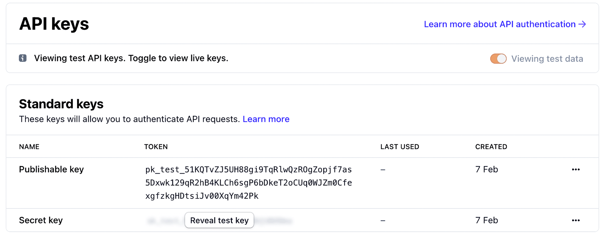
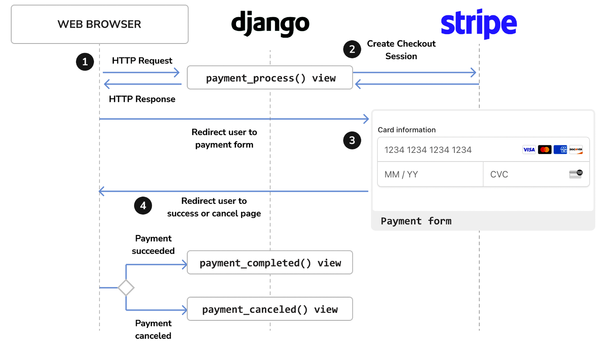

# Managing the payment method (Stripe)
# 1. Creating a Stripe Account
- [Sign up](https://dashboard.stripe.com/register) for a Stripe account
- [Activate](https://dashboard.stripe.com/account/details) your account
- [Get your API keys](https://dashboard.stripe.com/account/apikeys) from the Stripe dashboard
# 2. Installing the Stripe Python library
- Install the Stripe Python library with pip:
```bash
pip install --upgrade stripe
```
# 3. Using the Stripe Python library
- Get stripe public key and secret key from the Stripe dashboard


- Add the following settings to the settings.py file of your project:
```python
# Stripe settings
STRIPE_PUBLISHABLE_KEY = '' # Publishable key
STRIPE_SECRET_KEY = ''      # Secret key
STRIPE_API_VERSION = '2022-08-01'
```
# 4. Integrating Stripe Checkout
- shows the checkout payment flow


- Add the following code to the views.py file of your project:
```python
import stripe
from django.conf import settings
from django.shortcuts import render, redirect, get_object_or_404
from django.urls import reverse
from decimal import Decimal
from order.models import Order

# create the Stripe instance
stripe.api_key = settings.STRIPE_SECRET_KEY
stripe.api_version = settings.STRIPE_API_VERSION

def payment_process(request):
    order_id = request.session.get('order_id')
    order = get_object_or_404(Order, id=order_id)
    if request.method == 'POST':
        success_url = request.build_absolute_uri(reverse("payment:completed"))
        cancel_url = request.build_absolute_uri(reverse("payment:canceled"))
        # Stripe checkout session data
        session_data = {
            "mode": "payment",
            "client_reference_id": order.id,
            "success_url": success_url,
            "cancel_url": cancel_url,
            "line_items": [],
        }
        # add order items to the Stripe checkout session
        for item in order.items.all():
            session_data["line_items"].append(
                {
                    "price_data": {
                        "unit_amount": int(item.price * Decimal("100")),
                        "currency": "usd",
                        "product_data": {
                            "name": item.product.name,
                        },
                    },
                    "quantity": item.quantity,
                }
            )
        # create Stripe checkout session
        session = stripe.checkout.Session.create(**session_data)
        # redirect to Stripe payment form
        return redirect(session.url, code=303)
    else:
        return render(request, "payment/process.html", {"order": order})
```
### Let's explain the preceding code:
- The payment_process() view function is used to create a Stripe checkout session and redirect the user to the Stripe payment form.
- The order_id variable is used to get the order object from the database.
- The success_url and cancel_url variables are used to redirect the user to the payment:completed and payment:canceled views, respectively.
- The session_data dictionary is used to store the Stripe checkout session data.
- The session_data dictionary is used to create a Stripe checkout session.
- The redirect() function is used to redirect the user to the Stripe payment form.
- We use the following information for each item:
```python
for item in order.items.all():
            session_data["line_items"].append(
                {
                    "price_data": {
                        "unit_amount": int(item.price * Decimal("100")),
                        "currency": "usd",
                        "product_data": {
                            "name": item.product.name,
                        },
                    },
                    "quantity": item.quantity,
                }
            )
```
- price_data: Price-related information.
    - unit_amount: The amount in cents to be collected by the payment. This is a positive integer representing how much to charge in the smallest currency unit with no decimal places. For example, to charge $10.00, this would be 1000 (that is, 1,000 cents). The item price, item.price, is multiplied by Decimal(‘100’) to obtain the value in cents and then it is converted into an integer.
    - currency: The currency to use in three-letter ISO format. We use usd for US dollars. You can see a list of supported currencies at (https://stripe.com/docs/currencies).
    - product_data: Product-related information.
        - name: The name of the product.
- quantity: The number of units to purchase.

- The payment_completed() view function is used to display the payment completed page.
```python
def payment_completed(request):
    return render(request, "payment/completed.html")
```
- The payment_canceled() view function is used to display the payment canceled page.
```python
def payment_canceled(request):
    return render(request, "payment/canceled.html")
```
- Add the following code to the urls.py file of your project:
```python
from django.urls import path
from . import views
app_name = "payment"

urlpatterns = [
    path("process/", views.payment_process, name="process"),
    path("completed/", views.payment_completed, name="completed"),
    path("canceled/", views.payment_canceled, name="canceled"),
]
```
- Build the templates for the payment process and the completed
- Edit the main urls.py file of the myshop project:
```python
urlpatterns = [
    ...
    path('payment/', include('payment.urls', namespace='payment')),
    ...
    ]
```
# 5. Testing the Stripe payment process

|Result| Test Credit Card | CVC | Expiry date |
|--|--|--|--|
| Successful payment | 4242 4242 4242 4242 | Any 3 digits | Any future date |
| Failed payment | 4000 0000 0000 0002 | Any 3 digits | Any future date |
| Requires 3D secure authentication | 4000 0025 0000 3155 | Any 3 digits | Any future date |
